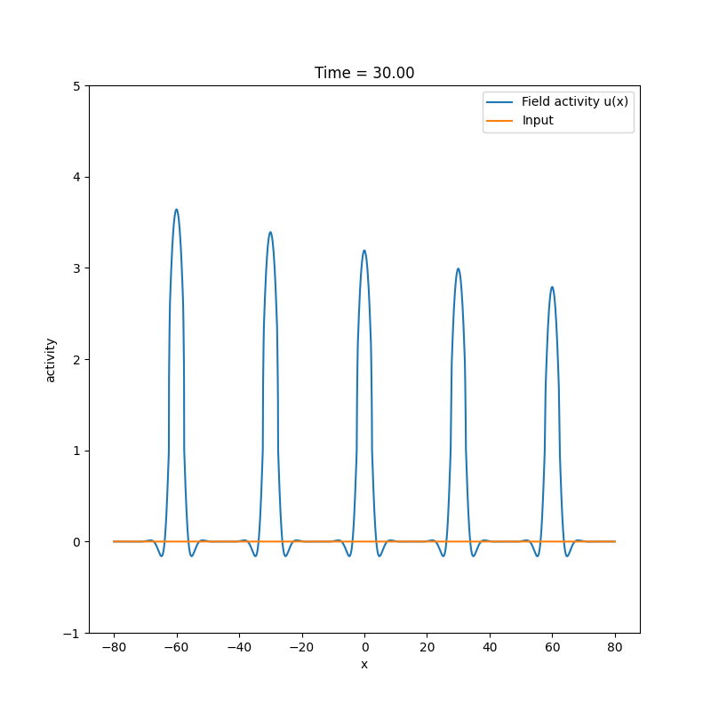

This repo hosts Python code for DNF (Dynamin Neural Field) architectures from the article:

Wojtak, W., Ferreira, F., Louro, L., Bicho, E., & Erlhagen, W. (2023). Adaptive timing in a dynamic field architecture for natural human–robot interactions. Cognitive Systems Research, 82, 101148.
https://www.sciencedirect.com/science/article/pii/S1389041723000761

Run `learning_demo.py` to see an example of sequence learning in a neural field. In this demo, a sequence of five Gaussian inputs is applied to the field. Each input triggers a bump of activity that persists after the input is removed, effectively serving as a memory trace.

Due to local threshold accommodation at the bump locations, the bumps grow in amplitude over time. This leads to the formation of an activation gradient, where the largest bump corresponds to the first input, followed by progressively smaller bumps for later inputs (see Figure below).

<!--  -->

dnf architecture- basic

implements temporal adaptation

dnf architecture- extended